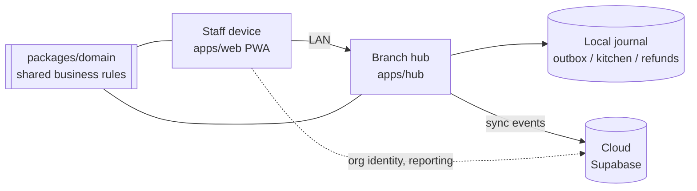

<div align="center">

# ☕ CafePOS

**Offline-first point-of-sale for multi-branch cafes and restaurants in Myanmar and Thailand.**

<p>
  
  
  
  
  
  
</p>

</div>

CafePOS runs the counter, the kitchen display, and the till on a tablet or PC,
with a Windows branch hub that keeps a branch trading through an internet
outage. Owners still get one consolidated view once the branch is back online.

## What CafePOS is

The product has three moving parts:

- **`apps/web`** — the Next.js touch POS, kitchen display, and installable PWA
  staff interface, in English and Thai.
- **`apps/hub`** — a Windows-hosted branch service: the local LAN API,
  on-disk journal storage, and the sync agent that talks to the cloud.
- **`packages/domain`** — framework-independent business rules (money, tax,
  orders, refunds, shifts) shared by both runtimes, so the same calculation
  runs the same way everywhere it's used.

## Product principles

- **The branch hub is authoritative for live operations; the cloud is
  authoritative for identity and consolidated reporting.** A branch keeps
  trading with no internet connection — nothing on the till blocks on a
  network call it doesn't need.
- **Money is deterministic, never floating-point.** Amounts are safe-integer
  minor units with an explicit currency; tax is rounded half-up on integer
  basis points. The same inputs produce the same totals in the till, the
  hub, receipts, exports, and reconciliation.
- **Sync is idempotent and auditable, not best-effort.** Every local
  mutation travels as an immutable, versioned event. Conflicts are surfaced
  explicitly — never silently overwritten by whichever write happened to
  arrive last.
- **Bilingual is the default, not a layer bolted on.** Every staff-facing
  screen and message goes through the same English/Thai translation layer;
  there's no "translate later."
- **Release-ready means operator-tested, not just green CI.** The checklist
  gates on real backup/restore verification and smoke testing on branch
  hardware, not test-suite output alone.

## Architecture



## Repository layout

```text
apps/web/          Next.js POS, kitchen display, and PWA shell
apps/hub/           Windows branch service — LAN API, storage, sync agent
packages/domain/     Shared, framework-independent business rules
docs/adr/            Architecture decisions — the "why" behind the design
docs/                Release checklist, readiness plan, user guide
supabase/            Cloud schema and migrations
DIARY.md             Dated, first-person build log
```

See [Architecture Decision 0001](docs/adr/0001-local-first-monorepo.md) for
the full system-boundary and data-ownership rationale, and
[`DIARY.md`](DIARY.md) for a running account of what shipped and why.

## Current status

CafePOS is feature-complete. Current work is documentation, process
refinement, and periodic quality-hardening passes — not new product
features. The remaining work before production launch is operational:

- environment and secrets setup
- branch hub installation and hardware validation
- backup export and restore verification
- operator smoke testing on real branch hardware
- country-specific compliance and signoff

Use the release checklist as the minimum gate and the production readiness
plan as the launch record. For the exact enforcement split between blocked,
warned, and informational behaviors, see
[docs/ENFORCEMENT_MATRIX.md](docs/ENFORCEMENT_MATRIX.md).

## Requirements

- Node.js 22
- Corepack with pnpm 10.13.1

## Local development

```bash
corepack enable
pnpm install
cp .env.example .env
pnpm dev
```

The web app defaults to `http://localhost:3000`. The branch hub defaults to
`http://127.0.0.1:4310`, with health information at `/health`.

The staff interface supports English and Thai. The header language control
stores its selection on the device, while currency and dates use the
browser's locale-aware `Intl` formatters.

The release checklist lives in
[docs/RELEASE_CHECKLIST.md](docs/RELEASE_CHECKLIST.md) and should be
followed before production deployment. The broader go-live plan is in
[docs/PRODUCTION_READINESS_PLAN.md](docs/PRODUCTION_READINESS_PLAN.md), and
day-to-day staff/manager usage is documented in
[docs/USER_GUIDE.md](docs/USER_GUIDE.md).

## Delivery model

Every change ships as its own branch and pull request — one feature or fix
per PR, validated with `pnpm release:check` before merge, never batched.
Feature and merge commits both carry the day the work was actually done,
kept sequential and gap-free across the project's history; see `DIARY.md`
for the first-person log that runs alongside them.

## Quality checks

```bash
pnpm release:check
```

Runs formatting, linting, type-checking, tests, the production build, and a
dependency audit gated at high severity — the same check every PR must pass
before it merges.

## Security and fiscal configuration

Never commit production credentials or customer data. Tax, receipt,
retention, and fiscal-device settings must be reviewed by qualified advisers
in each country before a production deployment. Follow the release
checklist for the minimum operator smoke test and backup validation steps.

## License

CafePOS is available under the [MIT License](LICENSE).
